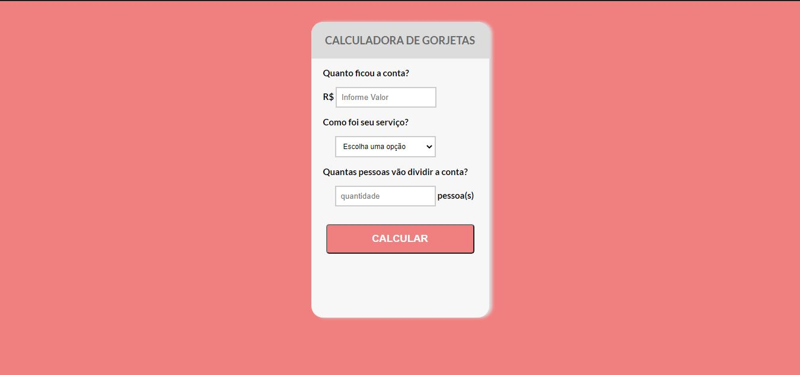

# Projeto - Calculadora de Gorjetas

## Desafio - HTML | CSS | Javascript 

Esse repositório foi desenvolvido com base no curso de Programador Full Stack Javascript - OneBitCode    

  

# 💻 Sobre o projeto

Calculadora de Gorjeta [e um projeto simples para testar as habilidades do Curso de Programador Full Stack Javascript modulos HTML5 | CSS3 | Javascript 
Movimentamos o Javascript DOM usando sus principais funções e caracteristicas, adicionar e manipular eventos, prevenir eventos, alterar estilos, alterar HTML.

## Template da aplicação
  

---
### 🛠 Tecnologias

As seguintes tecnologias foram usadas no desafio do projeto:

- [HTML5](https://developer.mozilla.org/pt-BR/docs/Web/HTML)
- [CSS3](https://developer.mozilla.org/pt-BR/docs/Web/CSS)
- [Javascript](https://developer.mozilla.org/pt-BR/docs/Web/JavaScript)

 